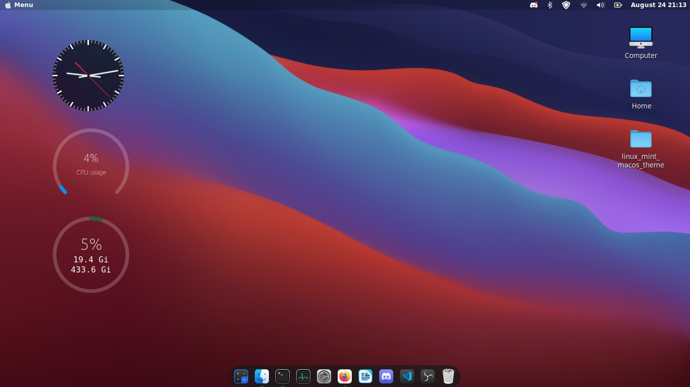
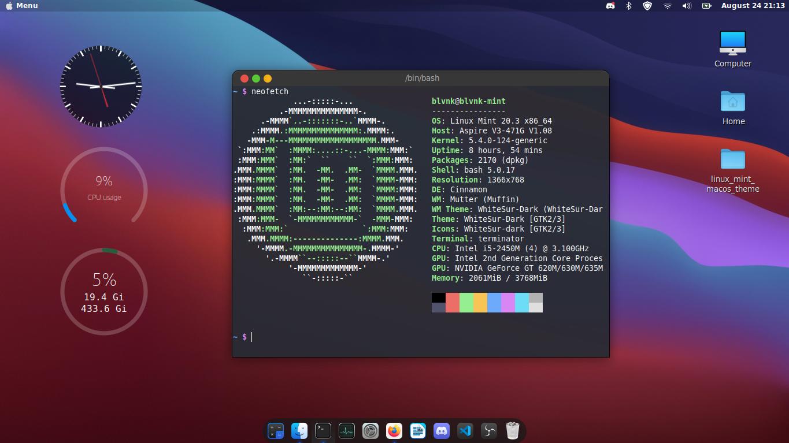
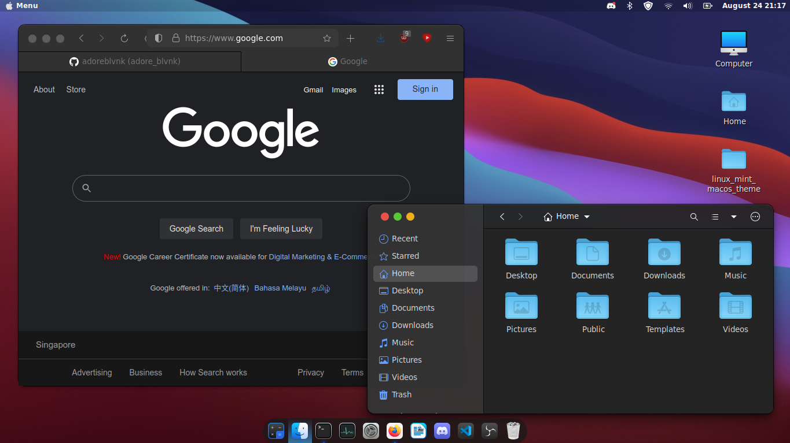
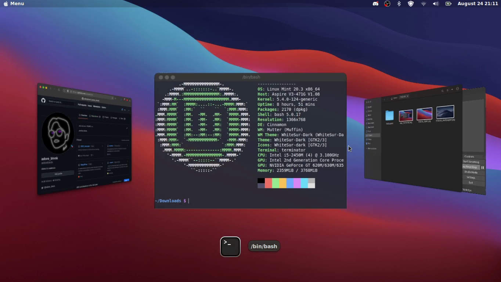
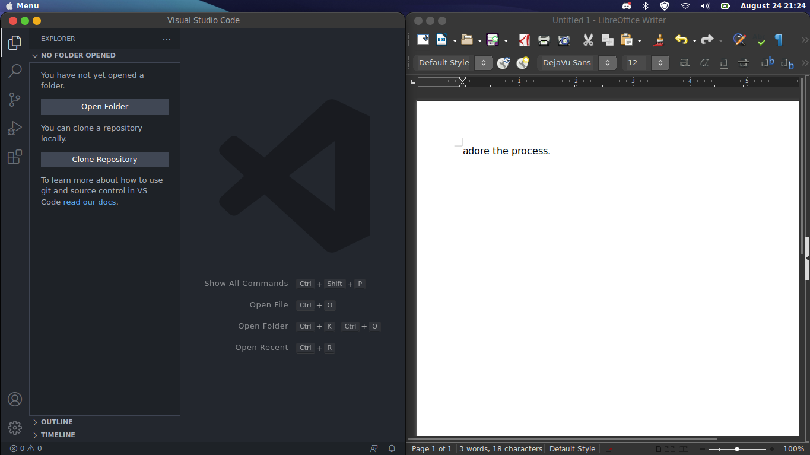
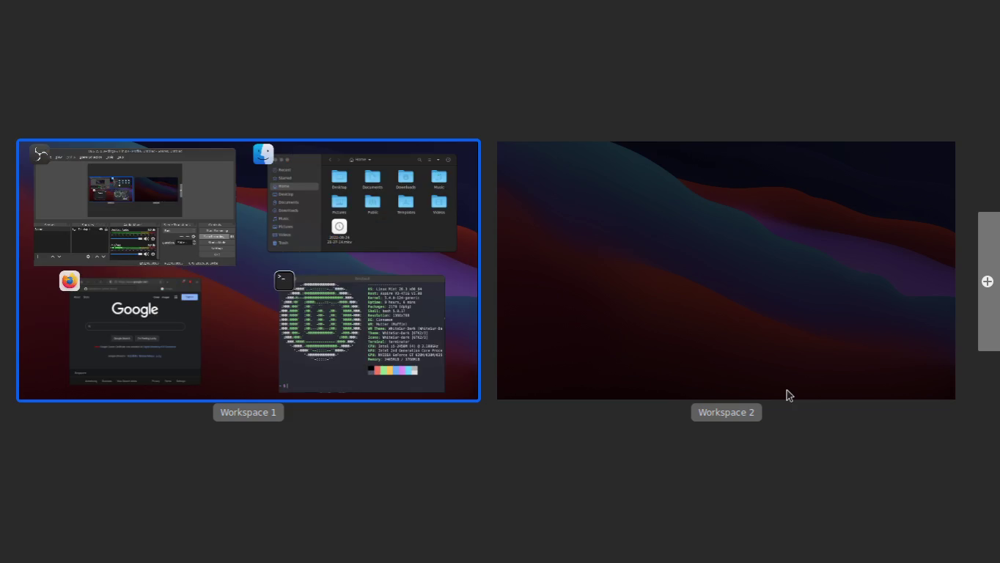

<div align="center">
     <!-- Logo -->
    <h1>Linux Mint Setup Guide</h1> <!-- Title -->
    <p>
      Linux Mint post-installation script & guide for an aesthetically pleasing machine, inclusive of "daily driver" utilities.
    </p> <!-- Description -->
</div>

---

<details>
<summary>Table of Contents</summary>

- [Demo](#demo)
- [Getting Started](#getting-started)
  - [Prerequisites](#prerequisites)
- [Usage](#usage)
  - [Script Execution](#script-execution)
  - [Manual Configurations](#manual-configurations)
</details>

## Demo













## Getting Started

### Prerequisites

**Installed Linux Mint 20.3+**

Download Linux Mint ISO from [linuxmint.com](https://linuxmint.com/). Follow the default installation instructions.

**Other Versions**

*NOTE: This guide has been tested on Linux Mint 20.3 ["Una"](https://www.linuxmint.com/edition.php?id=292). Will most likely work on other versions.*

Linux Mint 21:

- gTile does not work currently.

## Usage

There are 2 parts to this guide: [Script Execution](#script-execution) & [Manual Configurations](#manual-configurations). The latter is necessary due to my laziness to add the necessary gsettings into `install.sh`.

The script is divided into 5 sections:

- Basics
- MacOS Theme
- [Optional] Additional Configurations: Pretty prompt, aliases, better autocompletion.
- Extras: Command line utilities such as tree, neofetch, bat, terminator.
- Apps: VLC, VS Code, Discord.

### Script Execution

1. Launch Firefox, then close it.
2. Download `install.sh` & place in user home directory (`~`).
3. Run `install.sh` via the following command. It's recommended to agree to the additional configurations, though not necessary.
   - ```sh
     chmod ug+x ./install.sh
     ./install.sh
     ```

### Manual Configurations

*NOTE: The "Windows" key is referred to as the "Super" key. Launch the Menu via the Super key.*

**Applying MacOS Theme**

1. Menu -> Themes
2. Select "WhiteSur-Dark" for "Icons", "Applications", & "Desktop".
3. Select "WhiteSur-Cursors" for "Mouse Pointer".
4. Menu -> Windows
5. Select "Left" for "Buttons Layout".
6. Under "Alt-Tab" group, select "Coverflow (3D)" for "Alt-Tab Switcher Style".

**Menu Bar**

1. Right-click panel, then move panel to top.
2. Menu -> Panel. Reduce "Panel Height" to 25.
3. Menu -> Applets.
4. Disable "Menu", "Show Desktop", & "Grouped Window List". We will be replacing the default Menu.
5. Configure "Calendar". Enable "Use a Custom Date Format", & type `%B %e %H:%M` for the "Date Format". 
6. Under "Download" group, download "Cinnamenu".
7. Under "Manage" group, enable "Cinnamenu".
8. Configure "Cinnamenu":
   - Select "Top" for "Sidebar Location".
   - Disable "Show Bookmarks and Places", "Show Recent Items".
   - Under "Search", select "None" for "Web Search Option".
   - Disable "Web Search Suggestions".
   - Under "Appearance", enable "Use a Custom Icon".
   - Decrease "Applications Grid Icon Size (Pixels)" to 32.
9. Right-click panel, then enable "Panel Edit Mode". Drag Cinnamenu to the left. Disable "Panel Edit Mode".

**Plank (Dock)**

1. Menu -> Plank
2. Ctrl Right-click the Plank, then select "Theme-Dark" for "Theme".
3. [Optional] Decrease "Icon Size" to 32.
4. Under "Docklets" group, drag "Trash" to Plank.
5. Menu -> Startup Applications. We will be adding Plank to startup.
6. Add -> Choose Application -> Plank

**File Menu (Nautilus)**

1. Menu -> Preferred Applications
2. Select "Nautilus" for "File Manager". If 2 "Files" are shown, select the 2nd option.

**Firefox**

1. Firefox -> Application Menu -> More Tools -> Customize Toolbar
2. Drag "New Tab" button to the right of the address bar.
3. Uncheck "Title Bar" at the bottom.

**[Optional] Terminator**

1. Menu -> Preferred Applications
2. Select "Terminator" for "Terminal".

**[Optional] Fonts**

1. Menu -> Font Selection
2. Select "DejaVu Sans Book" font for "Default Font", "Desktop Font", "Document Font", "Window Title Font".
3. Select "DejaVu Sans Mono Book" font for "Monospace Font".

**[Optional] gTile (Window Tiler)**

1. Menu -> Extensions -> "Download" group
2. Download & enable gTile.
3. Layout:
   - |       Layout        | Columns | Rows |
     | :-----------------: | :-----: | :--: |
     | Layout For Button 1 |    1    |  1   |
     | Layout For Button 2 |  1, 1   |  1   |
     | Layout For Button 3 | 1, 2, 1 |  1   |
     | Layout For Button 4 |  1, 1   | 1, 1 |

## Credits

- blvnk
- [vinceliuice](https://twitter.com/vinceliuice)
